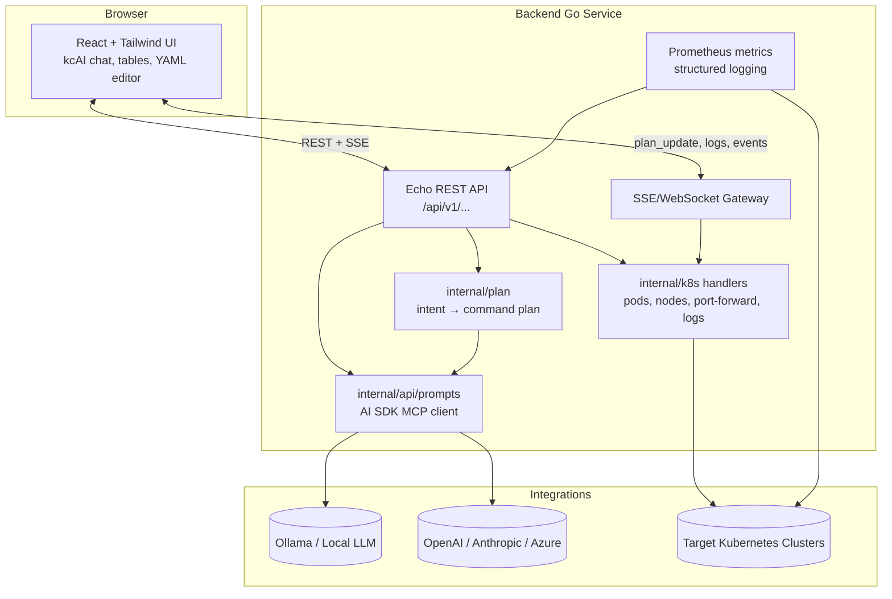

# KubeChat

**Natural Language Kubernetes Management Platform**

> Transform complex kubectl operations into intuitive conversations with your cluster while maintaining enterprise-grade security and compliance.


[](LICENSE)
[](https://golang.org/)
[](https://reactjs.org/)
[](https://www.typescriptlang.org/)
[](https://kubernetes.io/)
[](https://www.docker.com/)
[](https://helm.sh/)
[](https://www.postgresql.org/)
[](https://redis.io/)
[](https://ollama.ai/)
[](https://openai.com/)
[](https://tailwindcss.com/)

## 🌟 What is KubeChat?

KubeChat is an **open-source Natural Language Kubernetes Management Platform** that bridges the gap between Kubernetes complexity and operational efficiency. Instead of memorizing kubectl commands, simply chat with your cluster:

```
"Show me all pods with high memory usage in production"
"Scale the payment-service deployment to handle weekend traffic" 
"What's causing the API gateway to be unhealthy?"
```

**🎯 Perfect for:** DevOps teams, SREs, and platform engineers who need simplified Kubernetes management without compromising security or compliance standards.

## 🚀 Why KubeChat?

### ✨ **Natural Language First**
- Chat with your cluster using plain English
- No more memorizing complex kubectl syntax
- Contextual suggestions and intelligent command translation

### 🔒 **Enterprise-Grade Security**
- **Air-gapped deployment** with Ollama (runs completely offline)
- Built-in RBAC integration and audit logging
- Zero external API calls required for AI processing
- Complete compliance-ready audit trails

### 🎛️ **Modern Web Interface**
- Beautiful, responsive dashboard with real-time cluster monitoring
- Multi-user collaborative troubleshooting
- Progressive disclosure for beginners to experts
- WebSocket-powered live updates

### 🧠 **Multi-LLM Support**
- **Ollama** (default) - Local, air-gapped AI processing
- **OpenAI** - Cloud-powered enhanced capabilities  
- **Intelligent fallback** between providers
- No vendor lock-in

### 🔧 **Production-Ready**
- Kubernetes-native deployment with Helm charts
- Supports all major K8s distributions (EKS, GKE, AKS, OpenShift, Rancher)
- Horizontal scaling and high availability
- Built-in monitoring and observability

## 🏗️ Architecture

The control plane is a single Go binary that embeds the React frontend and exposes REST + SSE endpoints. It shards cleanly into API, streaming, AI-provider, and Kubernetes adapter layers and can run either per cluster or as a hub pointing at multiple kubeconfigs. A Helm chart packages the same binary for in-cluster installs with TLS, persistent volume mounts, and optional ingress.



More detail (service boundaries, data flows, and architectural decisions) lives in:

- [Architecture Overview](docs/architecture.md)
- [Architecture Decision Records](docs/architecture-decisions.json)
- [Epic ↔ Architecture Mapping](docs/architecture-epic-mapping.json)
- [Implementation Readiness Report](docs/implementation-readiness-report.md)

---

## ✨ Current Capabilities (October 2025)

| Area | Status | Description |
|------|--------|-------------|
| Conversational AI & planning | ✅ | `kcAI` chat uses the AI SDK MCP transport to Ollama/OpenAI and `internal/plan` to generate risk-tagged kubectl plans with editable parameters and SSE plan updates. |
| Plan preview & incident context | ✅ | React drawer renders clusters/namespaces, blast radius summaries, recommended diagnostics, and lets operators follow along via real-time `plan_update` events. |
| Multi-cluster resource explorer | ✅ | Tables and detail panes stream pods, nodes, events, deployments, CRDs, and YAML using the shared SSE server; cluster and kubeconfig context switching is first-class. |
| Streaming diagnostics | ✅ | Built-in log tailing, YAML viewer (Monaco), live events, and port-forwarding handlers surface diagnostics without leaving the UI (`/api/v1/.../logs`, `/portforward`). |
| Guardrail foundations | ✅ | Dry-run/apply scaffolding, plan risk annotations, Prometheus metrics, and structured audit logging stubs are implemented; approvals & rollback automation land next. |
| Packaging & deployment | ✅ | Single binary embeds the UI (`go:embed backend/routes/static`) and Helm chart values support TLS, PVCs, image overrides, and Rancher Desktop/kind workflows. |

> These capabilities cover the MVP slice for Epics **E1** and **E3** in the [Epic breakdown](docs/epics.md) and align with functional requirements **FR-1**, **FR-3**, and parts of **FR-4** in the [PRD](docs/PRD.md).

---

## 🗺️ Roadmap Alignment (from PRD / Epics)

| Epic / FR | Description | Status |
|-----------|-------------|--------|
| **E1 / FR-1** AI-Assisted Command Planning | Natural-language intents → explainable kubectl plan | ✅ MVP shipped (kcAI chat, plan builder, risk annotations); advanced editing/approvals queued |
| **E2 / FR-2** Guarded Execution & Approvals | Dry-run enforcement, approvals, RBAC, rollback | 🚧 Dry-run plumbing & metrics landed; policy evaluation + approval UX next |
| **E3 / FR-3** Multi-Cluster Visibility | Aggregated diagnostics, scoped actions | ✅ Core resource explorer, context banner, streamed diagnostics live |
| **E4 / FR-4** Streaming Observability | Live logs, rollout status, AI summaries | ✅ SSE-powered logs/events/plan updates in UI; exec session replay forthcoming |
| **E5 / FR-5** Audit & Reporting | Tamper-evident audit trails, exports | ⏳ PostgreSQL-backed audit store & export flow scheduled |
| **E6 / FR-6** Packaging & AI Abstraction | Single binary, Helm chart, provider plugins | ✅ Go binary embeds UI, Helm chart + MCP provider abstraction delivered |
| **FR-7** Workflow Governance | Guardrailed recipes, post-incident notes | ⏳ Design underway per `docs/stories/` backlog |

For full requirements and design principles, see:
- [Product Requirements Document](docs/PRD.md)
- [Epic definitions](docs/epics.md)
- [Architecture overview](docs/architecture.md)

---

## 🧱 Architecture Snapshot

```
┌────────────────────────┐   REST + SSE    ┌────────────────────────┐
│ React UI (Plan Drawer) │ ◄──────────────►│ Go API (internal/api)   │
└────────────────────────┘                │  - PromptController     │
                                          │  - PlanRepository       │
                                          │  - Telemetry exposure   │
                                          └────────────┬───────────┘
                                                       ▼
                                            ┌────────────────────┐
                                            │ Plan Builder       │
                                            │ (internal/plan)    │
                                            └────────────────────┘
```

- **Backend:** Go 1.24 module (`backend/`) with Echo router, SSE server, and Prometheus metrics.
- **Frontend:** React + TypeScript + Tailwind drawer rendered within the shell layout (`client/`).
- **Telemetrics:** Histogram and structured logging keyed by `request_id`.
- **Persistence:** In-memory repository (future stories will wire PostgreSQL per PRD).

---

## 🛠️ Local Development

```bash
# Backend
cd backend
Go env GOWORK=off go mod tidy
Go env GOWORK=off go test ./internal/...

# Frontend
cd ../client
pnpm install
pnpm run lint   # Note: legacy warnings remain; see eslint output for backlog items
pnpm run dev    # Starts Vite dev server with the React plan drawer
```

> ⚠️ Running `go test ./...` in restricted environments may fail when the MCP handler attempts to bind to localhost. Use `go test ./internal/...` for targeted coverage.

- Need end‑to‑end steps (UI build, Docker image, Helm deployment)? See [`docs/local-development.md`](docs/local-development.md).

---

## 📁 Repository Structure

```
backend/                      # Go services (API, plan builder, telemetry)
client/                       # React application (plan drawer, chat integration)
charts/                       # Helm assets (placeholder, upcoming stories)
docs/                         # PRD, epics, architecture, and sprint docs
```

---

## 🤝 Contributing

1. Fork the repository at [github.com/pramodksahoo/kubechat](https://github.com/pramodksahoo/kubechat)
2. Create a feature branch: `git checkout -b feature/plan-editor`
3. Run Go and frontend unit tests relevant to your change
4. Submit a pull request referencing the story / acceptance criteria

Please review the [code of conduct](CODE_OF_CONDUCT.md) before contributing.

---

## 📣 Support & Feedback

- Issues & feature requests: [GitHub Issues](https://github.com/pramodksahoo/kubechat/issues)
- Discussions & design questions: [GitHub Discussions](https://github.com/pramodksahoo/kubechat/discussions)
- Documentation hub: [`docs/`](docs/)

---

## ⭐ Project Vision

Kubechat aims to make Kubernetes safer and more approachable by combining conversational interfaces with governed execution. The current milestone proves out plan generation; upcoming stories will layer in approvals, audit trails, and packaging aligned with the PRD roadmap.

**Key Features:**
- 🤖 **Conversational AI & Plan Preview** – kcAI chat, risk-tagged kubectl plans, and editable parameters.  
- 📡 **Live Cluster Diagnostics** – streaming tables, YAML viewer, log tailing, and port-forward controls per cluster.  
- 🔄 **Guardrail Foundations** – dry-run defaults, risk scoring, Prometheus metrics, and structured audit hooks ready for approvals.  
- 🧠 **Pluggable AI Providers** – offline-first Ollama with optional OpenAI/Anthropic/Azure connectors via the MCP interface.  
- 🚢 **Batteries-Included Packaging** – single Go binary embeds the UI; Helm chart supports TLS, storage, and image pinning.  
- 📚 **PRD-Aligned Roadmap** – documented epics, architecture decisions, and UX specifications tracked in `docs/`.

---

**Built with ❤️ for the Kubernetes community**

*Making Kubernetes accessible through the power of natural language AI while maintaining enterprise-grade security and compliance.*
