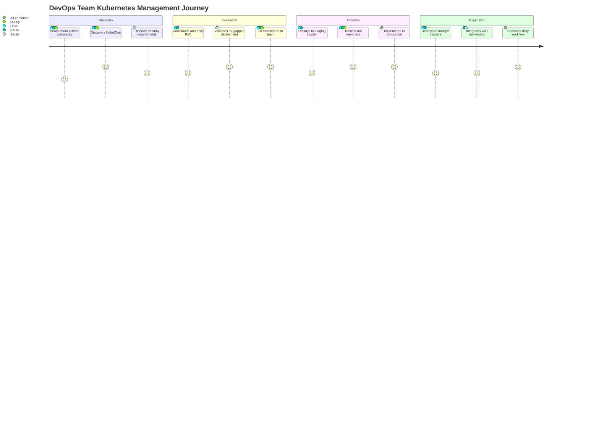

# KubeChat Product Requirements Document (PRD)
## Version 1.0 - MVP to Enterprise

---

## 1. Document Overview

### 1.1 Document Information
- **Product**: KubeChat - Natural Language Kubernetes Management Platform
- **Version**: 1.0 (MVP to Enterprise Transition)
- **Date**: January 2025
- **Owner**: Product Management Team
- **Status**: Draft for Stakeholder Review

### 1.2 Document Purpose
This PRD defines the requirements for evolving KubeChat from a successful Proof of Concept to an enterprise-ready product capable of competing with existing Kubernetes AI management solutions.

### 1.3 Stakeholders
- **Primary**: CTO, Engineering Lead, DevOps Teams
- **Secondary**: Security Team, Customer Success, Sales Engineering
- **External**: Early adopter customers, Open source community

---

## 2. Product Vision & Strategy

### 2.1 Vision Statement
> "KubeChat will be the world's leading open-source, web-based Kubernetes AI assistant that enables any team member to manage clusters through natural language, regardless of their kubectl expertise."

### 2.2 Product Mission
Democratize Kubernetes management by providing an intuitive, secure, and collaborative natural language interface that runs entirely within customer infrastructure.

### 2.3 Success Metrics
- **Adoption**: 1,000+ active installations within 12 months
- **Engagement**: 80%+ of users perform weekly cluster operations via KubeChat
- **Enterprise**: 50+ enterprise deployments (>1,000 employees) within 18 months
- **Community**: 5,000+ GitHub stars, 100+ contributors

---

## 3. Market Analysis & Competitive Positioning

### 3.1 Target Market Segments
**Primary Markets:**
- Financial Services (Air-gapped requirements, compliance)
- Government/Defense (Security-first, classified environments)  
- Healthcare (HIPAA compliance, data sovereignty)
- Large Enterprise IT (Multi-team collaboration, cost optimization)

**Secondary Markets:**
- Kubernetes Consulting Firms (Client deployment tool)
- Managed Service Providers (Multi-tenant operations)
- Educational Institutions (Learning and training)

### 3.2 Competitive Differentiation
Refer to: `/docs/competitive-analysis.md`

**Key Differentiators:**
1. Web-based interface (vs CLI-only solutions)
2. In-cluster deployment (vs external dependencies)
3. Multi-user collaborative features
4. Complete air-gapped support
5. Open-source with enterprise features

---

## 4. User Personas & Journey

### 4.1 Primary Personas

#### **"DevOps Engineer Dave"**
- **Background**: 5+ years Kubernetes experience, kubectl expert
- **Goals**: Faster cluster operations, better team collaboration
- **Pain Points**: Training junior team members, repetitive command creation
- **KubeChat Usage**: Advanced queries, multi-cluster operations, mentoring others

#### **"Platform Engineer Paula"**
- **Background**: 2-3 years K8s experience, focuses on infrastructure
- **Goals**: Reliable deployments, monitoring cluster health
- **Pain Points**: Complex kubectl syntax, troubleshooting failures
- **KubeChat Usage**: Deployment management, resource monitoring, incident response

#### **"Developer Danny"**
- **Background**: Application developer, limited Kubernetes knowledge
- **Goals**: Deploy apps, check status, debug issues
- **Pain Points**: Steep kubectl learning curve, fear of breaking things
- **KubeChat Usage**: Simple queries, application deployment, log analysis

#### **"Security Lead Sarah"**
- **Background**: InfoSec professional, compliance-focused
- **Goals**: Audit access, ensure policy compliance, secure operations
- **Pain Points**: Tracking who did what, ensuring proper permissions
- **KubeChat Usage**: Audit reviews, policy enforcement, access control

### 4.2 User Journey Mapping



---

## 5. Functional Requirements

### 5.1 Core Features (MVP Enhancement)

#### **F1: Enhanced Natural Language Processing**
- **Priority**: P0 (Must Have)
- **Description**: Improve query understanding and command generation accuracy
- **Requirements**:
  - Support for complex multi-step operations
  - Context awareness across conversation sessions
  - Support for 50+ common Kubernetes operations
  - Error handling and suggestion improvements
- **Acceptance Criteria**:
  - 90%+ accuracy on standard kubectl operations
  - <3 second response time for simple queries
  - Graceful handling of ambiguous requests
  - Support for follow-up questions and clarifications

#### **F2: Advanced Web User Interface**
- **Priority**: P0 (Must Have)
- **Description**: Professional web interface for enterprise use
- **Requirements**:
  - Modern React-based UI with responsive design
  - Real-time chat interface with typing indicators
  - Command preview and confirmation for destructive operations
  - Visual representation of cluster resources (pods, services, etc.)
  - Export functionality for queries and results
- **Acceptance Criteria**:
  - Mobile-friendly responsive design
  - Sub-second UI interactions
  - Accessibility compliance (WCAG 2.1 AA)
  - Support for dark/light themes

#### **F3: Multi-Cluster Management**
- **Priority**: P0 (Must Have)  
- **Description**: Manage multiple Kubernetes clusters from single interface
- **Requirements**:
  - Cluster discovery and registration
  - Context switching between clusters
  - Cross-cluster queries and comparisons
  - Cluster health and status monitoring
- **Acceptance Criteria**:
  - Support for 10+ clusters per KubeChat instance
  - Clear visual indication of active cluster
  - Prevent accidental cross-cluster operations
  - Cluster connection status monitoring

### 5.2 Enterprise Features

#### **F4: Role-Based Access Control (RBAC)**
- **Priority**: P0 (Must Have)
- **Description**: Enterprise-grade user management and permissions
- **Requirements**:
  - Integration with existing K8s RBAC
  - User authentication and authorization
  - Namespace-level access controls
  - Operation restrictions (read-only, specific verbs)
  - Admin interface for user management
- **Acceptance Criteria**:
  - Respects existing kubectl permissions
  - LDAP/Active Directory integration
  - SAML/OAuth2 authentication support
  - Audit trail for all user actions

#### **F5: Advanced Audit Logging**
- **Priority**: P1 (Should Have)
- **Description**: Comprehensive audit and compliance capabilities
- **Requirements**:
  - Detailed logging of all operations
  - Export capabilities for compliance reporting
  - Integration with external logging systems
  - User activity tracking and reporting
  - Retention policy management
- **Acceptance Criteria**:
  - Structured JSON audit logs
  - Integration with Splunk, ELK stack
  - Configurable retention policies
  - Real-time log streaming capability

#### **F6: Multi-Tenant Architecture**
- **Priority**: P1 (Should Have)
- **Description**: Support multiple organizations/teams in single deployment
- **Requirements**:
  - Organization/team isolation
  - Separate cluster access per tenant
  - Resource usage tracking per tenant
  - Customizable branding per tenant
- **Acceptance Criteria**:
  - Complete data isolation between tenants
  - Tenant-specific configuration
  - Resource quotas and limits per tenant

### 5.3 Advanced Features

#### **F7: Plugin Architecture**
- **Priority**: P2 (Nice to Have)
- **Description**: Extensible plugin system for custom integrations
- **Requirements**:
  - RESTful plugin API
  - Custom command extensions
  - Third-party tool integrations
  - Community plugin marketplace
- **Acceptance Criteria**:
  - Well-documented plugin API
  - Example plugins for common tools
  - Plugin lifecycle management
  - Security sandboxing for plugins

#### **F8: AI Model Management**
- **Priority**: P1 (Should Have)
- **Description**: Advanced LLM configuration and optimization
- **Requirements**:
  - Support for multiple AI providers (OpenAI, Anthropic, local models)
  - Model performance monitoring
  - A/B testing for different models
  - Custom model fine-tuning capabilities
- **Acceptance Criteria**:
  - Hot-swapping between AI models
  - Performance metrics for model comparison
  - Cost tracking for external AI services

#### **F9: Collaboration Features**
- **Priority**: P1 (Should Have)
- **Description**: Team collaboration and knowledge sharing
- **Requirements**:
  - Shared conversation histories
  - Query templates and snippets
  - Team knowledge base
  - Real-time collaboration on complex operations
- **Acceptance Criteria**:
  - Searchable conversation history
  - Template sharing across teams
  - Comment and annotation system
  - Real-time co-browsing capabilities

---

## 6. Non-Functional Requirements

### 6.1 Performance Requirements
- **Response Time**: 95% of queries respond within 3 seconds
- **Throughput**: Support 100+ concurrent users per instance
- **Scalability**: Horizontal scaling across multiple pods
- **Resource Usage**: <2GB RAM, <1 CPU core for standard workload

### 6.2 Security Requirements
- **Authentication**: Multi-factor authentication support
- **Encryption**: TLS 1.3 for all communications, at-rest encryption for logs
- **Network Security**: Support for network policies and service mesh
- **Compliance**: SOC2 Type II, GDPR, HIPAA compliance capabilities
- **Vulnerability Management**: Regular security scanning, CVE monitoring

### 6.3 Reliability Requirements
- **Availability**: 99.9% uptime SLA
- **Recovery**: <30 second recovery from AI service failures
- **Data Integrity**: No data loss during system failures
- **Backup**: Automated backup of configuration and audit logs

### 6.4 Usability Requirements
- **Learning Curve**: New users productive within 15 minutes
- **Accessibility**: WCAG 2.1 AA compliance
- **Internationalization**: Support for English, with framework for additional languages
- **Documentation**: Comprehensive user guides, API documentation, troubleshooting guides

---

## 7. Technical Architecture

### 7.1 System Architecture Overview

```
┌─────────────────┐    ┌─────────────────┐    ┌─────────────────┐
│   Web Frontend  │    │   API Gateway   │    │ LLM Service     │
│   (React)       │◄──►│   (Go/Gin)      │◄──►│ (Ollama/OpenAI) │
└─────────────────┘    └─────────────────┘    └─────────────────┘
                                │
                                ▼
                       ┌─────────────────┐
                       │ Kubernetes API  │
                       │ (client-go)     │
                       └─────────────────┘
```

### 7.2 Component Specifications

#### **Frontend Stack**
- **Framework**: React 18+ with TypeScript
- **State Management**: Redux Toolkit + RTK Query
- **UI Library**: Material-UI or Ant Design
- **Build Tool**: Vite for fast development and builds
- **Testing**: Jest + React Testing Library

#### **Backend Stack**
- **Language**: Go 1.21+
- **Web Framework**: Gin HTTP framework
- **Database**: PostgreSQL for audit logs, Redis for caching
- **Authentication**: JWT tokens with refresh mechanism
- **Kubernetes Client**: client-go library

#### **AI/ML Stack**
- **Local Models**: Ollama with phi3:mini, llama2, qwen models
- **External APIs**: OpenAI GPT-4, Anthropic Claude, Google Gemini
- **Model Management**: Model registry and version control
- **Performance Monitoring**: Response time and accuracy metrics

### 7.3 Data Model

#### **User Management**
```sql
Users (id, email, name, role, created_at, last_login)
Organizations (id, name, settings, created_at)
UserOrganizations (user_id, org_id, role, permissions)
```

#### **Audit Logging**  
```sql
AuditLogs (id, user_id, cluster_id, query, command, result, timestamp, duration)
Clusters (id, name, endpoint, config_hash, status, last_seen)
```

#### **Configuration**
```sql
Settings (key, value, scope, created_at, updated_at)
Templates (id, name, query, description, tags, user_id)
```

---

## 8. Integration Requirements

### 8.1 Kubernetes Integration
- **API Version**: Support Kubernetes 1.19+ (last 3 major versions)
- **RBAC**: Full integration with Kubernetes RBAC system
- **CRDs**: Support for Custom Resource Definitions
- **Operators**: Compatibility with Kubernetes operators

### 8.2 External System Integration
- **Identity Providers**: LDAP, Active Directory, SAML, OAuth2
- **Monitoring**: Prometheus metrics export, Grafana dashboards
- **Logging**: FluentD, Logstash, Splunk integration
- **Security**: Integration with security scanning tools (Falco, OPA)

### 8.3 CI/CD Integration
- **GitOps**: Integration with ArgoCD, Flux
- **Pipelines**: GitHub Actions, Jenkins, GitLab CI
- **Container Registries**: Docker Hub, Harbor, ECR, GCR

---

## 9. Development Milestones & Timeline

### 9.1 Phase 1: MVP Enhancement (Months 1-3)
**Goals**: Transform PoC into production-ready MVP

**Month 1**:
- [ ] Enhanced web UI with professional design
- [ ] Improved natural language processing
- [ ] Basic user authentication
- [ ] Multi-cluster support foundation

**Month 2**:
- [ ] RBAC integration
- [ ] Advanced audit logging
- [ ] Performance optimizations
- [ ] Security hardening

**Month 3**:
- [ ] Documentation and help system
- [ ] Testing and quality assurance
- [ ] Community feedback integration
- [ ] Beta release preparation

### 9.2 Phase 2: Enterprise Features (Months 4-6)
**Goals**: Add enterprise-grade capabilities

**Month 4**:
- [ ] Multi-tenant architecture
- [ ] Advanced AI model management
- [ ] Plugin architecture foundation
- [ ] Enterprise authentication (LDAP/SAML)

**Month 5**:
- [ ] Collaboration features
- [ ] Advanced reporting and analytics
- [ ] Performance monitoring and alerting
- [ ] Customer pilot programs

**Month 6**:
- [ ] Enterprise deployment tooling
- [ ] Professional services framework
- [ ] Partner integration program
- [ ] General availability release

### 9.3 Phase 3: Scale & Growth (Months 7-12)
**Goals**: Scale platform and grow community

**Months 7-9**:
- [ ] Plugin marketplace
- [ ] Advanced AI features (fine-tuning, custom models)
- [ ] Mobile application
- [ ] International localization

**Months 10-12**:
- [ ] Edge computing support
- [ ] Advanced compliance certifications
- [ ] Enterprise partnerships
- [ ] Open source community programs

---

## 10. Success Metrics & KPIs

### 10.1 Product Metrics
- **User Adoption**: Monthly Active Users (MAU)
- **Feature Usage**: Query volume, feature adoption rates
- **Performance**: Response times, system uptime, error rates
- **Quality**: User satisfaction scores, support ticket volume

### 10.2 Business Metrics
- **Growth**: New installations per month, user retention rate
- **Revenue**: Enterprise customer acquisition, support contract value
- **Market**: Market share in Kubernetes management tools
- **Community**: GitHub stars, contributions, community engagement

### 10.3 Technical Metrics
- **Reliability**: System availability, error rates, recovery time
- **Performance**: Query processing time, resource utilization
- **Security**: Security incident count, vulnerability response time
- **Quality**: Test coverage, defect rates, code quality scores

---

## 11. Risk Assessment & Mitigation

### 11.1 Technical Risks
**Risk**: AI model accuracy and reliability
- **Impact**: High - Core product functionality
- **Probability**: Medium
- **Mitigation**: Multiple model support, human oversight, extensive testing

**Risk**: Kubernetes API changes breaking compatibility  
- **Impact**: High - Product stops working
- **Probability**: Low
- **Mitigation**: Automated testing against multiple K8s versions, deprecation tracking

**Risk**: Scaling challenges with large clusters
- **Impact**: Medium - Performance degradation  
- **Probability**: Medium
- **Mitigation**: Performance testing, caching strategies, query optimization

### 11.2 Business Risks
**Risk**: Competitive pressure from established players
- **Impact**: High - Market share loss
- **Probability**: High  
- **Mitigation**: Fast feature development, strong community building, unique positioning

**Risk**: Open source cannibalization of enterprise revenue
- **Impact**: Medium - Reduced monetization
- **Probability**: Medium
- **Mitigation**: Clear feature differentiation, value-added services, support contracts

### 11.3 Operational Risks
**Risk**: Security vulnerabilities in AI components
- **Impact**: High - Customer trust and compliance
- **Probability**: Medium
- **Mitigation**: Regular security audits, vulnerability scanning, responsible disclosure

**Risk**: Insufficient developer resources
- **Impact**: High - Delayed delivery
- **Probability**: Medium  
- **Mitigation**: Phased development, community contributions, strategic hiring

---

## 12. Resource Requirements

### 12.1 Development Team
- **Engineering Lead**: 1 FTE (Full-time equivalent)
- **Senior Full-Stack Engineers**: 3 FTE  
- **Frontend Specialists**: 2 FTE
- **DevOps/Infrastructure**: 1 FTE
- **QA/Testing**: 1 FTE
- **Total**: 8 FTE for 12 months

### 12.2 Infrastructure Costs
- **Development Environment**: $2,000/month
- **Testing Infrastructure**: $3,000/month  
- **CI/CD Pipeline**: $1,000/month
- **External AI APIs**: $5,000/month (testing and demo)
- **Total**: ~$11,000/month operational costs

### 12.3 Marketing & Business Development
- **Product Marketing**: 1 FTE
- **Technical Writing**: 0.5 FTE
- **Community Manager**: 0.5 FTE
- **Sales Engineering**: 1 FTE (Phase 2+)

---

## 13. Go-to-Market Strategy

### 13.1 Launch Strategy
**Phase 1**: Community-first approach
- Open source release with full PoC features
- Developer conference presentations
- Technical blog content and tutorials
- GitHub community building

**Phase 2**: Enterprise engagement  
- Target early adopter enterprises
- Professional services offering
- Partnership with Kubernetes consulting firms
- Enterprise trial programs

**Phase 3**: Market expansion
- Cloud marketplace listings (AWS, Azure, GCP)
- Integration partner program
- Channel partner recruitment
- International expansion

### 13.2 Pricing Model
**Community Edition**: Free, open source
- Core natural language interface
- Single cluster support
- Basic audit logging
- Community support

**Professional Edition**: $50/user/month
- Multi-cluster management
- Advanced RBAC integration
- Priority support
- Professional services credits

**Enterprise Edition**: Custom pricing
- Multi-tenant architecture
- Advanced compliance features
- Dedicated support
- Custom integrations
- SLA guarantees

---

## 14. Conclusion & Next Steps

### 14.1 Executive Summary
KubeChat represents a significant market opportunity to democratize Kubernetes management through natural language interfaces. Our competitive analysis shows clear differentiation opportunities, and the technical foundation from our successful PoC provides confidence in execution capability.

### 14.2 Immediate Actions Required
1. **Stakeholder Approval**: Review and approve this PRD
2. **Team Formation**: Recruit core development team
3. **Technical Architecture**: Detailed system design review
4. **Customer Discovery**: Validate requirements with target customers
5. **Partnership Exploration**: Identify potential integration partners

### 14.3 Decision Gates
- **Month 1**: MVP feature scope finalization
- **Month 3**: Beta release readiness review
- **Month 6**: Enterprise feature prioritization
- **Month 9**: Scale and growth strategy review

---

**Document Status**: Draft for Review  
**Next Review Date**: TBD  
**Approval Required From**: CTO, Engineering Lead, Product Marketing

*This PRD is a living document that will evolve based on customer feedback, market changes, and technical discoveries during development.*