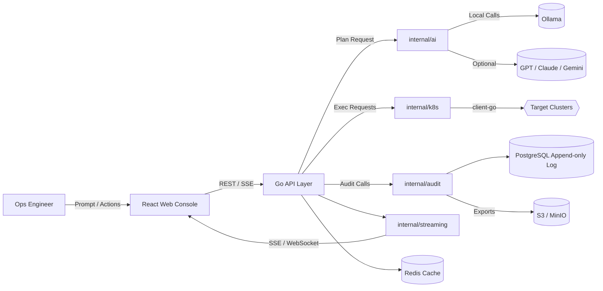
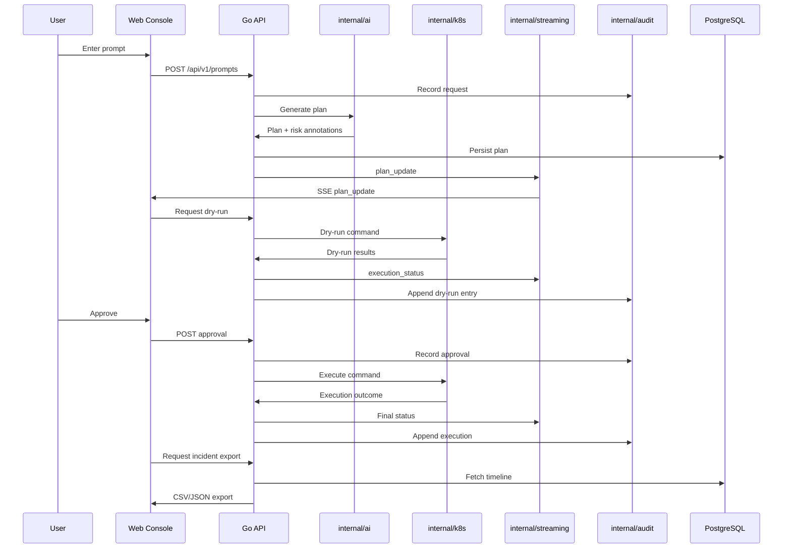
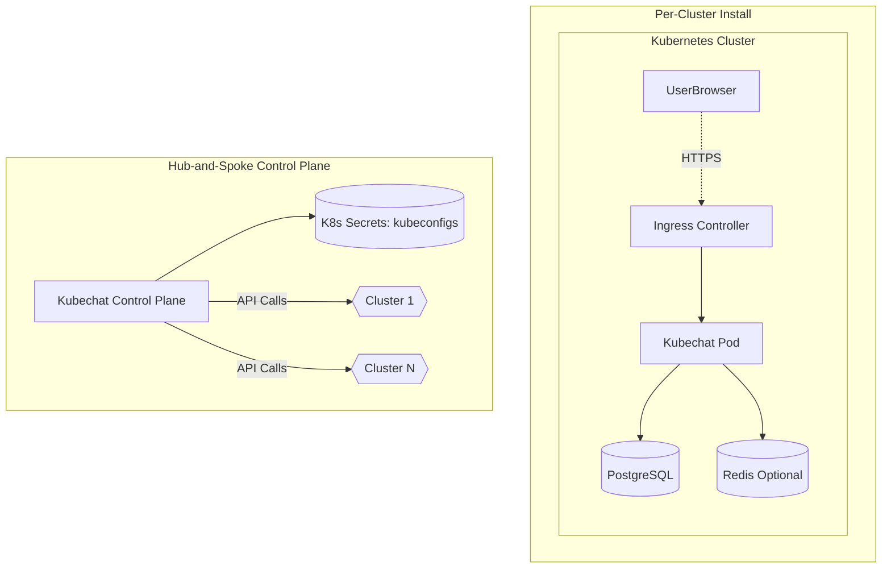

# Kubechat Architecture

Generated: 2025-10-30T09:28:31.282142Z

## 1. Executive Summary

Kubechat evolves the Kubechat monorepo (Go backend + React frontend) into a chat-driven Kubernetes operations console. We retain the single-process Go service with a modular internal package layout for AI providers, audit logging, streaming, and Kubernetes orchestration. Deployments support both per-cluster Helm releases and hub-and-spoke control planes, with offline-first AI adapters, tamper-evident auditing, and SSE-first streaming that degrades gracefully in constrained environments.

## 2. Project Initialization

```bash
git clone https://github.com/pramodksahoo/kubechat.git kubechat
cd kubechat
git checkout -b feature/kubechat
go mod tidy
pnpm install
```

This first implementation story anchors development on the upstream structure before layering Kubechat modules.

## 3. Decision Summary

| Category | Decision | Version (verified 2025-10-30) | Rationale |
| --- | --- | --- | --- |
| Deployment | Hybrid per-cluster + hub-spoke model | N/A | Default to per-cluster Helm install for isolation; optionally run a central control plane connecting to multiple clusters via kubeconfigs. |
| AI Providers | In-process adapter interface with optional sidecar connectors | In-process (Go 1.23) | Keeps architecture simple for offline default (Ollama) while allowing cloud providers behind explicit egress control. |
| Audit Logging | PostgreSQL append-only log with hash chaining and optional external sinks | PostgreSQL 15 | Meets tamper-evident compliance requirement while keeping baseline simple. |
| Streaming | SSE primary channel with polling fallback; WebSockets for exec sessions | Go SSE/WebSocket 1.23 | Simplifies deployment (proxy-friendly) while meeting low-bandwidth requirements and allowing bi-directional exec when required. |
| Persistence | PostgreSQL primary store; SQLite for local mode; optional Redis/Object storage | PostgreSQL 15 / SQLite 3.45 / Redis 7 | Keeps baseline simple while allowing scale-out knobs for caching and long-term storage. |
| Packaging | Single binary + Helm chart with CRDs, container images linux/amd64 & arm64 | Go 1.23 / Node 20 / Helm 3.14 | Aligns with Kubechat distribution while meeting customer-managed cluster expectations. |
| Security | Defense-in-depth: TLS, JWT, RBAC pre-check, non-root containers, no secrets in logs, signed artifacts | TLS 1.3 / JWT (RFC 7519) | Ensures compliance readiness and safe operations across regulated environments. |
| Configuration | CRDs (AIProvider, AuditPolicy) + secrets for cluster credentials | Kubernetes CRD v1 | Supports both per-cluster and hub installs with Kubernetes-native configuration. |
| CI/CD | GitHub Actions pipeline for multi-arch builds, tests, SBOM, signing | GitHub Actions 2025-10 / cosign 2.2 | Aligns with community workflow while producing compliant artifacts. |
| Identity | Local users + JWT sessions + RBAC with optional OIDC | Local auth + JWT / OIDC 1.0 | Delivers secure defaults while allowing enterprise identity integrations. |
| Observability | Opt-in adapters: Prometheus metrics, Loki/ELK logs, OpenTelemetry tracing | Prometheus 2.50 / Loki 2.9 / OTEL 1.10 | Keep core lightweight but ready for enterprise observability stacks. |

## 4. Technology Stack

| Layer | Technology | Version | Notes |
| --- | --- | --- | --- |
| Language | Go | 1.23.0 | Matches Kubechat baseline; pinned in go.mod |
| Frontend | Node / pnpm / React | Node 20.11 LTS / pnpm 9 / React 18 | Vite bundler, Storybook optional |
| Kubernetes SDK | client-go | 0.29.x | Supports Kubernetes N-3 |
| Database | PostgreSQL | 15.x | Primary data + audit store |
| Local store | SQLite | 3.45 | Single-binary local mode |
| Cache | Redis (optional) | 7.x | Rate limiting, session cache |
| Object storage (optional) | S3-compatible | MinIO RELEASE.2025-09-20 | Incident exports |
| Observability | Prometheus / Loki / OTEL | 2.50 / 2.9 / 1.10 | Opt-in adapters |
| CI/CD | GitHub Actions / cosign / syft | Oct-2025 / 2.2 / 1.15 | SBOM + signed artifacts |

## 5. System Overview

### Component Diagram



### Core Components
- **Control Plane Service (Go 1.23)**
  - API endpoints for chat, plan generation, approvals
  - AI provider abstraction and inference orchestration
  - Kubernetes command execution and audit logging
  - Streaming (SSE/WebSocket) pipelines
  - Packages: internal/api, internal/ai, internal/audit, internal/k8s
- **Web Console (React + Vite)**
  - Timeline view and command palette
  - Plan preview and approval workflow UI
  - Multi-cluster dashboards and log viewers
  - Settings/onboarding – kubeconfig, providers
- **PostgreSQL (PostgreSQL 15)**
  - Audit log (append only with hash chain)
  - Configuration storage (clusters, policies, providers)
  - User accounts and roles
  - Session state for collaboration
- **Streaming Gateway (Go SSE/WebSocket)**
  - Plan execution status streaming
  - Log tail delivery
  - Fallback polling orchestration

### Optional Components
- **Redis Cache** — Rate limiting, Session acceleration, AI provider caching. Deployment: Optional Helm values.
- **Object Storage** — Incident exports, Large log archives. Deployment: Customer-provided S3/MinIO.

### External Integrations
- **Prometheus** via Scrape metrics endpoint /metrics → Performance dashboards.
- **Loki/ELK** via Optional log sink connector → Centralized log lake.
- **PagerDuty/Slack/Jira** via Outgoing webhooks → Incident notifications and workflow.

## 6. Source Tree


kubechat/
├── cmd/
│   └── kubechat/            # main.go entrypoint, CLI flags, config load
├── internal/
│   ├── ai/                 # provider adapters, rate limiting, redaction
│   ├── api/                # REST/SSE endpoints, validation, auth middleware
│   ├── audit/              # append-only writer, hash chain, export handlers
│   ├── k8s/                # client-go wrappers, namespace locks, dry-run helpers
│   ├── streaming/          # SSE dispatcher, WebSocket hub for exec
│   ├── web/                # embedded asset server, CSP/HSTS headers
│   └── config/             # environment + CRD configuration loader
├── pkg/
│   ├── middleware/         # logging, panic recovery, request ID propagation
│   ├── rbac/               # policy evaluation helpers
│   ├── telemetry/          # Prometheus collectors, OTEL exporters
│   └── utils/              # shared utilities (hashing, pagination, retries)
├── frontend/
│   ├── src/
│   │   ├── components/
│   │   ├── features/       # plan cards, timeline, approvals, logs
│   │   ├── stores/         # state management (Zustand/Redux)
│   │   ├── services/       # API clients, SSE listeners
│   │   └── routes/
│   └── public/
├── deployments/
│   └── helm/
│       ├── templates/
│       │   ├── crds/
│       │   ├── secrets.yaml
│       │   ├── deployment.yaml
│       │   └── ingress.yaml
│       └── values.yaml
├── scripts/
│   ├── ci/
│   └── tooling/
└── docs/
    └── architecture.md

## 7. Epic to Architecture Mapping

| Epic | Coverage |
| --- | --- |
| E1 | internal/ai + internal/api + internal/k8s |
| E2 | internal/audit + internal/api + internal/k8s |
| E3 | internal/api + internal/k8s + frontend components |
| E4 | internal/api + streaming gateway + frontend |
| E5 | internal/audit + PostgreSQL + export subsystem |
| E6 | Build/packaging pipeline + Helm + CRDs |

## 8. Data Flow & Interfaces



1. Prompt submitted → `internal/api` persists request + seeds audit chain.
2. `internal/ai` selects provider (Ollama default) → generates plan → redacts sensitive fields → stores plan + AI metadata.
3. Dry-run via `internal/k8s` (server-side apply with `--dry-run=server`) → results streamed through SSE (`/api/v1/stream/plan/{id}`) and recorded.
4. Approvals captured in PostgreSQL; RBAC policy evaluation results appended to audit log.
5. Execution applies command; status/logs streamed via SSE, exec sessions via WebSocket (`/api/v1/exec/{pod}`) with timeouts.
6. Incident summaries produced (AI-assisted) and persisted for export (`/api/v1/reports/incidents/{id}`).
7. Optional sinks (Loki/ELK) receive mirrored entries; periodic digest anchoring recorded.

## 9. Data Model Highlights

- `users(id, email, password_hash, role, oidc_subject, created_at)`
- `api_tokens(id, user_id, token_hash, last_used_at, expires_at)`
- `clusters(id, name, mode, kubeconfig_secret, namespace_allowlist)`
- `ai_providers(id, type, endpoint, auth_secret, rate_limit)`
- `audit_log(id, actor_id, action, cluster_id, payload_jsonb, prev_hash, entry_hash, anchored_digest, created_at)`
- `plans(id, incident_id, prompt, plan_jsonb, status)`
- `executions(id, plan_id, type, status, output_ref, rollback_ref)`
- `approvals(id, execution_id, approver_id, status, rationale)`
- `incidents(id, summary, severity, timeline_jsonb, created_at)`

## 10. Security Architecture

- TLS 1.3 enforced via Ingress or Go server; CSP + HSTS headers in `internal/web`.
- Authentication: local accounts + JWT (HS256/RS256) with refresh; optional OIDC integration (issuer discovery, client credentials).
- Authorization: RBAC middleware maps app roles to Kubernetes verbs; policy decisions recorded in audit chain.
- Audit: append-only log with SHA-256 hash chaining and daily digest anchoring; exports digitally signed.
- Secrets: store kubeconfigs/provider keys in Kubernetes Secrets or SealedSecrets; recommend rotation tooling.
- Containers: runAsNonRoot, readOnlyRootFilesystem, seccomp/apparmor profiles via Helm values.
## 11. Deployment Architecture

### Deployment Diagram



### Per-Cluster Helm Install
- Deployments: Kubechat + PostgreSQL (or external DSN) + optional Redis.
- CRDs: `aiproviders.kubechat.dev`, `auditpolicies.kubechat.dev`.
- Values toggles: `global.tls.enabled`, `ingress.enabled`, `externalDatabase.enabled`, `redis.enabled`.
### Hub-and-Spoke Control Plane
- Single Kubechat instance with `clusters` configuration referencing remote kubeconfigs stored as secrets.
- NetworkPolicies allow outbound to specified Kubernetes API endpoints; optional proxy/bastion support.
- Audit exports can be scoped per cluster; CRDs define retention.

## 12. Observability

- `/metrics` endpoint scraped by Prometheus 2.50.
- Structured JSON logs with request IDs, ready for Loki/ELK ingestion.
- Optional OpenTelemetry exporter (OTLP) for traces/spans.
- Webhook integrations for PagerDuty/Slack/Jira notifications.

## 13. Implementation Patterns

### Naming
- Go packages: `internal/<domain>` snake_case; exported types PascalCase.
- REST paths: `/api/v1/...`; SSE: `/api/v1/stream/...`.
- DB tables snake_case plural; columns snake_case.
- Frontend components PascalCase; hooks `useX`.

### Structure
- Tests: Go `_test.go` co-located; frontend tests under `__tests__`.
- Shared utilities in `pkg/` to avoid cycles.
- Config defaults defined in `internal/config/defaults.go` with env overrides.
- Frontend feature folders mirror epics (plan, approvals, observability, audit).

### Format
- API envelope `{ data, error, meta }`.
- Audit exports: CSV/JSON with RFC3339 timestamps.
- Logs: structured JSON via zap with `level`, `ts`, `msg`, `request_id`.

### Communication
- SSE events: `plan_update`, `execution_status`, `log_line`.
- WebSocket exec frames: `{ "type": "stdin"|"stdout", "payload": string }`.
- Internal events via Go channels, fan-out in `internal/streaming`.

### Lifecycle
- Loading states: skeletons for plan cards, shimmer rows for tables.
- Errors: toast + timeline entry + retry CTA.
- Retries: exponential backoff with jitter for AI/k8s actions (configurable).
- Rollback CTA persists until success confirmation.

### Location
- Config path `/etc/kubechat/config.yaml` or env; Helm values map to configmap.
- Embedded assets served from `internal/web`.
- Secrets stored in namespace; support for external secret managers via CSI.

### Consistency
- Dates displayed as `YYYY-MM-DD HH:mm:ss Z` (UTC).
- Risk badge colors follow design tokens (Emerald/Electric/Amber/Crimson).
- `X-Request-ID` propagated end-to-end; logs correlated via `request_id`.

## 14. Architecture Decision Records

- **Deployment** — Hybrid per-cluster + hub-spoke model (Version: N/A). Default to per-cluster Helm install for isolation; optionally run a central control plane connecting to multiple clusters via kubeconfigs.
- **AI Providers** — In-process adapter interface with optional sidecar connectors (Version: In-process (Go 1.23)). Keeps architecture simple for offline default (Ollama) while allowing cloud providers behind explicit egress control.
- **Audit Logging** — PostgreSQL append-only log with hash chaining and optional external sinks (Version: PostgreSQL 15). Meets tamper-evident compliance requirement while keeping baseline simple.
- **Streaming** — SSE primary channel with polling fallback; WebSockets for exec sessions (Version: Go SSE/WebSocket 1.23). Simplifies deployment (proxy-friendly) while meeting low-bandwidth requirements and allowing bi-directional exec when required.
- **Persistence** — PostgreSQL primary store; SQLite for local mode; optional Redis/Object storage (Version: PostgreSQL 15 / SQLite 3.45 / Redis 7). Keeps baseline simple while allowing scale-out knobs for caching and long-term storage.
- **Packaging** — Single binary + Helm chart with CRDs, container images linux/amd64 & arm64 (Version: Go 1.23 / Node 20 / Helm 3.14). Aligns with Kubechat distribution while meeting customer-managed cluster expectations.
- **Security** — Defense-in-depth: TLS, JWT, RBAC pre-check, non-root containers, no secrets in logs, signed artifacts (Version: TLS 1.3 / JWT (RFC 7519)). Ensures compliance readiness and safe operations across regulated environments.
- **Configuration** — CRDs (AIProvider, AuditPolicy) + secrets for cluster credentials (Version: Kubernetes CRD v1). Supports both per-cluster and hub installs with Kubernetes-native configuration.
- **CI/CD** — GitHub Actions pipeline for multi-arch builds, tests, SBOM, signing (Version: GitHub Actions 2025-10 / cosign 2.2). Aligns with community workflow while producing compliant artifacts.
- **Identity** — Local users + JWT sessions + RBAC with optional OIDC (Version: Local auth + JWT / OIDC 1.0). Delivers secure defaults while allowing enterprise identity integrations.
- **Observability** — Opt-in adapters: Prometheus metrics, Loki/ELK logs, OpenTelemetry tracing (Version: Prometheus 2.50 / Loki 2.9 / OTEL 1.10). Keep core lightweight but ready for enterprise observability stacks.

## 15. Risks & Mitigations

- Multi-cluster secret sprawl → Provide rotation guidance, prefer sealed secrets, document hub controls.
- AI latency/outsages → Circuit breakers, retries with backoff, clear UI messaging, fallback to local templates.
- Audit log growth → Configurable retention; export to object storage; scheduled pruning of anchored digests.
- SSE proxy issues → Automatic polling fallback, document required headers for reverse proxies, limit payload size.
- Compliance drift → Automated digest anchoring, export verification in CI, regular security reviews.

## 16. Next Steps

1. Implement foundational Go packages (`internal/ai`, `internal/audit`, `internal/streaming`, `internal/k8s`).
2. Extend Helm chart with AIProvider/AuditPolicy CRDs and values toggles for per-cluster vs hub installs.
3. Configure GitHub Actions pipeline (tests, scans, buildx, SBOM, cosign).
4. Coordinate with UX on plan card, timeline, approval features for vertical slices.
5. Produce deployment docs for both install patterns and security best practices.
