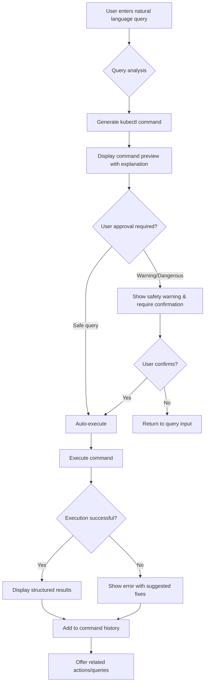
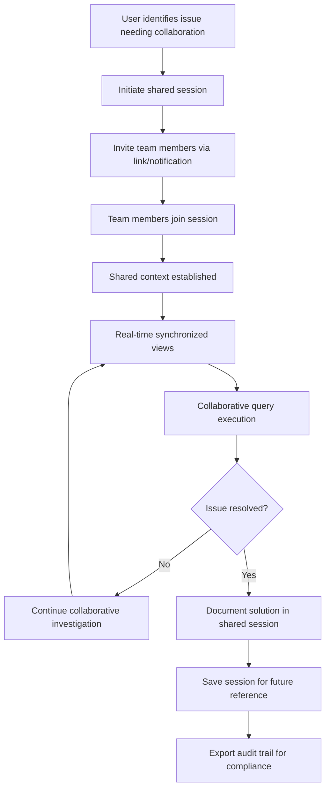
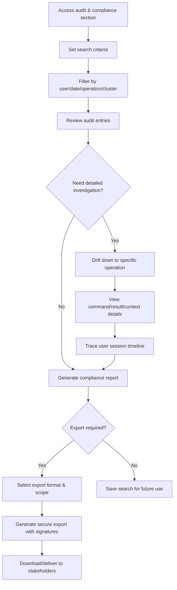

# KubeChat UI/UX Specification

## Introduction

This document defines the user experience goals, information architecture, user flows, and visual design specifications for KubeChat's user interface. It serves as the foundation for visual design and frontend development, ensuring a cohesive and user-centered experience that delivers on the unique value proposition of web-based Kubernetes management with natural language processing.

KubeChat's UX design directly addresses the competitive gaps identified in our analysis - while kubectl-ai, K8sGPT, and Lens Prism force users into CLI or desktop paradigms, KubeChat delivers enterprise-grade web accessibility with progressive disclosure and collaborative features.

### Overall UX Goals & Principles

#### Target User Personas

**Primary: Enterprise DevOps Engineer**
- Needs reliable kubectl operations through intuitive web interface
- Values audit trails and compliance features for regulated environments
- Requires collaborative troubleshooting with team members
- Expects professional, trustworthy interface design

**Secondary: Platform Administrator** 
- Manages multiple clusters and user access
- Needs real-time monitoring and system health visibility
- Values comprehensive audit and compliance reporting
- Requires role-based access control and security features

**Tertiary: Security/Compliance Officer**
- Focuses on audit trails, compliance reporting, and access control
- Needs clear documentation of all system activities
- Values transparent, traceable operations
- Requires professional documentation and export capabilities

#### Usability Goals

1. **Immediate Value:** New users can execute their first natural language query within 2 minutes of login
2. **CLI Transition:** kubectl users can accomplish familiar tasks 40% faster through web interface
3. **Team Collaboration:** Multiple users can troubleshoot issues together in real-time
4. **Enterprise Trust:** Professional aesthetics and robust features build confidence for enterprise adoption
5. **Progressive Learning:** Interface teaches Kubernetes concepts while remaining accessible to experts

#### Design Principles

1. **Enterprise Professionalism First** - Visual design conveys trust, reliability, and enterprise-grade quality
2. **Progressive Disclosure Over Feature Density** - Show complexity gradually based on user expertise and context
3. **Real-time Transparency** - All system states, connections, and processes are clearly visible
4. **Collaborative by Design** - Multi-user awareness and sharing built into core interactions
5. **Compliance-Ready Interface** - Every action supports audit trails and regulatory requirements

### Change Log

| Date | Version | Description | Author |
|------|---------|-------------|---------|
| 2025-01-10 | 1.0 | Initial UI/UX specification creation | Sally (UX Expert) |

---

## Information Architecture (IA)

### Site Map / Screen Inventory

```mermaid
graph TD
    A[KubeChat Dashboard] --> B[Chat Interface]
    A --> C[Cluster Monitor]
    A --> D[Audit & Compliance]
    A --> E[User Profile & Settings]
    
    B --> B1[Active Conversation]
    B --> B2[Command History]
    B --> B3[Shared Sessions]
    B --> B4[Favorites & Templates]
    
    C --> C1[Cluster Health Overview]
    C --> C2[Node Status & Resources]
    C --> C3[Workload Monitoring]
    C --> C4[Live Logs & Events]
    C --> C5[Resource Explorer]
    
    D --> D1[Audit Trail Viewer]
    D --> D2[Compliance Reports]
    D --> D3[User Activity Logs]
    D --> D4[Export & Download]
    
    E --> E1[Account Settings]
    E --> E2[RBAC Permissions]
    E --> E3[Notification Preferences]
    E --> E4[Cluster Connections]
    
    A --> F[Help & Documentation]
    F --> F1[Getting Started Guide]
    F --> F2[Natural Language Examples]
    F --> F3[kubectl Command Reference]
    F --> F4[Troubleshooting]
```

### Navigation Structure

**Primary Navigation:** 
Persistent horizontal navigation bar with five main sections: Dashboard (home), Chat Interface, Cluster Monitor, Audit & Compliance, and User Profile. Navigation uses recognizable icons with text labels, maintaining enterprise-standard UI patterns familiar to DevOps professionals.

**Secondary Navigation:** 
Context-sensitive sidebar within each main section, collapsible for space efficiency. Chat Interface shows conversation management, Cluster Monitor displays cluster/namespace selection, Audit section provides filtering and search options.

**Breadcrumb Strategy:** 
Contextual breadcrumbs appear in complex views like Resource Explorer and Compliance Reports, showing navigation path within hierarchical data structures. Format: Section > Subsection > Current View (e.g., "Cluster Monitor > Node Status > worker-node-01").

---

## User Flows

### Natural Language Query & Execution Flow

**User Goal:** Execute Kubernetes operations through conversational interface without memorizing kubectl syntax

**Entry Points:** 
- Main dashboard "Ask KubeChat" prompt
- Chat interface direct input
- Quick action buttons with auto-populated queries
- Context-sensitive suggestions from monitoring views

**Success Criteria:** User receives accurate kubectl command, understands what it will do, executes safely, and gets meaningful results

#### Flow Diagram

#### Edge Cases & Error Handling:
- **Ambiguous queries:** Present clarification options with suggested completions
- **Permission denied:** Show required RBAC permissions and suggest contacting administrator
- **Cluster connection issues:** Display connection status and retry options
- **Invalid resources:** Offer suggestions based on available resources in current context
- **Long-running operations:** Show progress indicators and allow cancellation
- **Session timeout:** Gracefully restore context and continue operation

**Notes:** This flow emphasizes the collaborative advantage - results can be shared with team members, and command history builds institutional knowledge that CLI tools cannot match.

### Real-time Collaboration & Troubleshooting Flow

**User Goal:** Collaborate with team members to troubleshoot Kubernetes issues using shared context and real-time updates

**Entry Points:**
- "Share session" from active chat conversation
- "Request help" from monitoring alert
- Team member invitation link
- Escalation from individual troubleshooting

**Success Criteria:** Multiple users can view same cluster state, share queries/results, and resolve issues faster than individual CLI troubleshooting

#### Flow Diagram

#### Edge Cases & Error Handling:
- **Permission conflicts:** Show read-only participation for users with limited RBAC
- **Network latency:** Graceful degradation with local caching and sync resolution
- **Session conflicts:** Merge strategies for concurrent operations with clear attribution
- **Large team sessions:** Performance optimization and UI scaling for 5+ participants
- **Cross-timezone collaboration:** Clear timestamps and user location indicators

### Compliance Audit Trail Review Flow

**User Goal:** Review and export comprehensive audit trails for regulatory compliance and security investigations

**Entry Points:**
- Scheduled compliance report generation
- Security incident investigation
- Regular audit review workflow
- External auditor request

**Success Criteria:** Complete, searchable audit trail with export capabilities meeting SOX, HIPAA, and SOC 2 requirements

#### Flow Diagram

#### Edge Cases & Error Handling:
- **Large date ranges:** Pagination and background processing for extensive audits
- **Missing permissions:** Clear indication of access limitations with escalation path
- **Data retention limits:** Clear indication of available data with archival options
- **Export size limits:** Automatic chunking with manifest file for large exports
- **Concurrent access:** Version control for audit data with change attribution

---

## Wireframes & Mockups

### Primary Design Files Location
**Primary Design Files:** Will be created in Figma workspace after UX specification approval - URL to be provided during visual design phase

### Key Screen Layouts

#### **KubeChat Dashboard (Landing Page)**

**Purpose:** Provide enterprise-grade overview that immediately demonstrates KubeChat's professional capabilities and multi-faceted value

**Key Elements:**
- **Header Navigation:** KubeChat logo, main navigation tabs (Dashboard, Chat, Monitor, Audit, Profile), user account dropdown, connection status indicators
- **Central Command Bar:** Prominent natural language input with placeholder text "Ask KubeChat: 'Show me pods with high memory usage in production'"
- **Quick Stats Cards:** Cluster health summary, active conversations, recent alerts, compliance status - all clickable for deeper exploration
- **Recent Activity Panel:** Last 5 operations with user attribution, timestamps, and quick re-execute options
- **Team Activity Stream:** Real-time feed of team member activities (when shared), fostering collaborative awareness
- **Cluster Overview Widget:** Current cluster context with quick cluster switching dropdown

**Interaction Notes:** Dashboard serves as central hub - all elements provide pathways to detailed views. Responsive grid adapts to screen size while maintaining enterprise professionalism.

**Design File Reference:** `/dashboard-main-view`

#### **Chat Interface (Primary Feature)**

**Purpose:** Showcase the natural language processing advantage that differentiates KubeChat from all CLI-based competitors

**Key Elements:**
- **Conversation Panel:** ChatGPT-style interface with message bubbles showing user queries, KubeChat responses, and command previews
- **Command Preview Cards:** Generated kubectl commands shown in expandable cards with safety classification (safe/warning/dangerous) and plain-English explanations
- **Result Visualization:** Structured display of command results with tables, JSON trees, and status indicators rather than raw terminal output
- **Sidebar Controls:** Conversation history, shared sessions, favorite queries, and team collaboration options
- **Context Indicators:** Current cluster/namespace context prominently displayed with easy switching
- **Safety Confirmation Modals:** For dangerous operations, clear modal dialogs with impact explanations and explicit confirmation requirements

**Interaction Notes:** Emphasizes conversational flow while maintaining enterprise safety requirements. Progressive disclosure shows kubectl commands for learning, but prioritizes natural language interaction.

**Design File Reference:** `/chat-interface-main`

#### **Real-time Cluster Monitor**

**Purpose:** Demonstrate web-based monitoring capabilities that provide superior collaboration and visualization compared to CLI tools

**Key Elements:**
- **Cluster Health Dashboard:** Real-time metrics with color-coded status indicators, resource utilization charts, and alert summaries
- **Interactive Resource Tree:** Expandable hierarchy showing namespaces, deployments, services, pods with click-to-query functionality
- **Live Log Stream:** Scrolling log viewer with filtering options and natural language query integration ("show me errors from payment service")
- **Visual Topology Map:** Interactive cluster diagram showing relationships between resources with health status overlays
- **Multi-pane Layout:** Resizable panels allowing users to monitor multiple aspects simultaneously
- **Collaborative Cursors:** When in shared session, show other users' focus areas and interactions

**Interaction Notes:** Clicking any visual element auto-generates relevant natural language queries, bridging monitoring and chat interfaces seamlessly.

**Design File Reference:** `/cluster-monitor-dashboard`

#### **Audit & Compliance Interface**

**Purpose:** Showcase enterprise compliance capabilities that CLI tools fundamentally cannot provide

**Key Elements:**
- **Audit Search Interface:** Advanced filtering by user, date range, operation type, cluster, with saved search profiles
- **Compliance Dashboard:** Real-time compliance status for SOX, HIPAA, SOC 2 with trend indicators and risk scores
- **Audit Trail Table:** Sortable, filterable table showing all operations with expandable details for full context
- **Export Controls:** Professional export interface with format options (PDF, CSV, JSON), digital signatures, and secure delivery
- **Investigation Tools:** Timeline view for incident investigation, user activity patterns, and correlation analysis
- **Compliance Report Generator:** Template-based report creation for different regulatory frameworks

**Interaction Notes:** Professional, spreadsheet-like interface emphasizing data integrity and enterprise reporting needs. Export functions include audit signatures and chain-of-custody documentation.

**Design File Reference:** `/audit-compliance-main`

#### **User Profile & Settings**

**Purpose:** Provide comprehensive user and system management that supports enterprise deployment requirements

**Key Elements:**
- **User Account Information:** Profile details, role assignments, and permission summary with clear RBAC visualization
- **Cluster Connection Management:** List of accessible clusters with connection status, credentials management, and access history
- **Notification Preferences:** Granular controls for alerts, collaboration invites, and system notifications with channel preferences
- **Security Settings:** Session management, API keys, audit preferences, and privacy controls
- **Team Management:** (For administrators) User provisioning, role assignment, and access audit capabilities
- **System Preferences:** Theme selection, layout preferences, and accessibility options

**Interaction Notes:** Clear information hierarchy with progressive disclosure of technical details. Administrative functions clearly separated from user preferences.

**Design File Reference:** `/user-profile-settings`

---

## Component Library / Design System

### Design System Approach

**Design System Approach:** Custom enterprise design system built on proven foundations, combining the reliability of established patterns (similar to Grafana, DataDog) with KubeChat-specific innovations for natural language interaction and collaborative features. This approach ensures enterprise acceptance while highlighting our unique value propositions.

### Core Components

#### **Natural Language Input Component**

**Purpose:** The signature component that showcases KubeChat's primary competitive advantage - natural language Kubernetes interaction

**Variants:**
- Primary (Dashboard featured input with prominent styling)
- Inline (Embedded in monitoring views for contextual queries)  
- Modal (Full-screen input for complex multi-line queries)
- Compact (Sidebar or toolbar integration)

**States:**
- Default (with helpful placeholder text and examples)
- Focused (expanded with suggestion dropdown)
- Processing (loading indicator with AI processing feedback)
- Success (with generated command preview)
- Error (with helpful corrections and suggestions)

**Usage Guidelines:** Always include contextual examples in placeholder text. Processing states must clearly indicate AI is working. Success state should show both natural language interpretation and generated kubectl command for transparency.

#### **Command Preview Card**

**Purpose:** Bridge between natural language and kubectl execution, building user confidence and enabling learning

**Variants:**
- Safe (green border, auto-execute available)
- Warning (yellow border, requires user confirmation)
- Dangerous (red border, requires explicit confirmation with impact explanation)

**States:**
- Preview (showing command with explanation)
- Approved (user has confirmed execution)
- Executing (progress indicators for long-running commands)
- Completed (with results summary)
- Failed (with error explanation and suggested fixes)

**Usage Guidelines:** Always include plain-English explanation of what the command does. Dangerous commands must show potential impact clearly. Results should be structured and visually appealing, not raw terminal output.

#### **Real-time Status Indicator**

**Purpose:** Provide constant visibility into system health and connection status, critical for enterprise trust

**Variants:**
- Cluster Connection (online/offline/degraded)
- AI Service (available/processing/unavailable)
- Collaboration Session (active/paused/ended)
- Audit Logging (recording/paused/error)

**States:**
- Healthy (green indicator with status text)
- Warning (yellow indicator with explanatory tooltip)
- Error (red indicator with action required)
- Unknown (gray indicator during status check)

**Usage Guidelines:** Use consistent color coding across all status types. Include tooltips with detailed status information and remediation steps where applicable.

#### **Collaborative Session Widget**

**Purpose:** Enable the multi-user capabilities that fundamentally differentiate KubeChat from single-user CLI tools

**Variants:**
- Session Initiator (for starting collaborative sessions)
- Participant List (showing active collaborators)
- Activity Feed (real-time updates of team actions)
- Shared Context Display (current focus areas)

**States:**
- Solo Mode (single user, with option to invite others)
- Active Collaboration (multiple users connected)
- Limited Participation (read-only access for some users)
- Session Ended (with option to review session archive)

**Usage Guidelines:** Clearly indicate user permissions and capabilities. Show real-time user activity without overwhelming the interface. Maintain audit trail of all collaborative actions.

#### **Audit Trail Entry**

**Purpose:** Support enterprise compliance requirements with professional, trustworthy audit interfaces

**Variants:**
- Compact List Item (for audit trail browsing)
- Detailed View (expandable with full context)
- Export Summary (formatted for compliance reporting)
- Investigation Focus (highlighting specific operations)

**States:**
- Standard Entry (normal operation logging)
- Flagged (marked for attention or investigation)
- Exported (included in compliance reports)
- Under Review (part of active investigation)

**Usage Guidelines:** Maintain consistent formatting across all audit entries. Include all required compliance information (user, timestamp, operation, result). Support filtering and searching across all audit data.

#### **Enterprise Data Table**

**Purpose:** Present complex Kubernetes data in professional, enterprise-standard format that supports both viewing and action

**Variants:**
- Resource Listing (pods, services, deployments)
- Audit Data (compliance and investigation focused)
- Monitoring Metrics (with real-time updates)
- User Management (administrative functions)

**States:**
- Loading (skeleton screens with progress indicators)
- Populated (data with sorting and filtering)
- Empty (helpful guidance for next steps)
- Error (with retry options and error details)

**Usage Guidelines:** Support enterprise-standard interactions (sorting, filtering, bulk actions). Integrate with natural language queries for advanced operations. Maintain responsive design for different screen sizes.

---

## Branding & Style Guide

### Visual Identity

**Brand Guidelines:** Custom brand identity emphasizing trustworthiness, innovation, and enterprise professionalism. Visual language balances modern AI capabilities with established enterprise software expectations.

### Color Palette

| Color Type | Hex Code | Usage |
|------------|----------|--------|
| Primary | #2563EB | Main actions, links, primary navigation - trustworthy blue conveying reliability |
| Secondary | #1E293B | Text, headers, professional contrast - enterprise-standard dark gray |
| Accent | #0EA5E9 | Highlights, notifications, real-time indicators - active cyan for dynamic elements |
| Success | #10B981 | Safe operations, healthy status, positive feedback - reassuring green |
| Warning | #F59E0B | Caution operations, attention needed - standard warning amber |
| Error | #EF4444 | Dangerous operations, errors, critical alerts - clear red for safety |
| Neutral | #64748B, #94A3B8, #CBD5E1, #F1F5F9 | Borders, backgrounds, secondary text - professional gray scale |

### Typography

#### Font Families
- **Primary:** Inter (modern, highly legible sans-serif optimized for enterprise interfaces)
- **Secondary:** Inter (consistent family across all text)
- **Monospace:** JetBrains Mono (for kubectl commands, logs, and technical content)

#### Type Scale

| Element | Size | Weight | Line Height |
|---------|------|--------|-------------|
| H1 | 2.25rem (36px) | 700 (Bold) | 2.5rem |
| H2 | 1.875rem (30px) | 600 (Semibold) | 2.25rem |
| H3 | 1.5rem (24px) | 600 (Semibold) | 2rem |
| Body | 1rem (16px) | 400 (Regular) | 1.5rem |
| Small | 0.875rem (14px) | 400 (Regular) | 1.25rem |

### Iconography

**Icon Library:** Lucide React - comprehensive, enterprise-appropriate icon set with consistent visual weight and professional appearance

**Usage Guidelines:** Icons should enhance, not replace, text labels in primary navigation. Use 24px icons for primary actions, 16px for secondary actions. Maintain consistent icon style throughout the application.

### Spacing & Layout

**Grid System:** 8-point grid system with 12-column responsive layout. Base spacing unit of 8px creates visual rhythm and consistency across all interface elements.

**Spacing Scale:** 4px, 8px, 16px, 24px, 32px, 48px, 64px progression provides clear visual hierarchy while maintaining professional density appropriate for data-heavy enterprise interfaces.

---

## Accessibility Requirements

### Compliance Target

**Standard:** WCAG 2.1 Level AA compliance with selected Level AAA features for government and healthcare market requirements

### Key Requirements

**Visual:**
- Color contrast ratios: 4.5:1 for normal text, 3:1 for large text (18pt+), 3:1 for UI components and graphical elements
- Focus indicators: High-contrast (4.5:1 minimum) visible focus rings for all interactive elements with 2px minimum thickness
- Text sizing: Support browser zoom up to 200% without horizontal scrolling, with scalable UI components maintaining functionality

**Interaction:**
- Keyboard navigation: Complete keyboard accessibility for all functionality, logical tab order, visible skip links, and keyboard shortcuts for power users
- Screen reader support: Semantic HTML structure, comprehensive ARIA labels, live regions for dynamic content updates, and descriptive alt text for all informational graphics
- Touch targets: Minimum 44px touch targets for mobile/tablet interfaces with adequate spacing to prevent accidental activation

**Content:**
- Alternative text: Descriptive alt text for all charts, graphs, and status indicators, with longer descriptions for complex data visualizations
- Heading structure: Proper H1-H6 hierarchy for logical content structure and navigation, with section landmarks for major interface areas
- Form labels: Explicit labels for all form inputs with error identification and suggestions, plus contextual help text where needed

### Testing Strategy

**Automated Testing:** Integration with axe-core accessibility testing in CI/CD pipeline, automated color contrast validation, and keyboard navigation testing

**Manual Testing:** Screen reader testing with NVDA and JAWS, keyboard-only navigation validation, and high contrast mode verification

**User Testing:** Accessibility user testing with diverse disability perspectives, including blind/low vision users and mobility-impaired users interacting with complex Kubernetes interfaces

---

## Responsiveness Strategy

### Breakpoints

| Breakpoint | Min Width | Max Width | Target Devices |
|------------|-----------|-----------|----------------|
| Mobile | 320px | 767px | Smartphones for emergency access and incident response |
| Tablet | 768px | 1023px | iPads and tablets for monitoring and collaboration |
| Desktop | 1024px | 1439px | Standard enterprise workstations and laptops |
| Wide | 1440px | - | Large monitors and dual-screen setups common in DevOps teams |

### Adaptation Patterns

**Layout Changes:** 
- Desktop: Multi-column layout with persistent sidebars for navigation and context
- Tablet: Collapsible sidebar navigation with full-width content area, optimized for touch interaction
- Mobile: Single column with bottom navigation and slide-up panels for secondary content

**Navigation Changes:**
- Desktop: Horizontal primary navigation with persistent secondary sidebars
- Tablet: Collapsible hamburger menu with full-screen navigation overlay when expanded
- Mobile: Bottom tab navigation for primary sections with contextual back navigation

**Content Priority:**
- Desktop: Full information density with comprehensive data tables and multi-pane layouts
- Tablet: Moderate information density with swipe gestures for additional details
- Mobile: Essential information only with progressive disclosure and priority-based content ordering

**Interaction Changes:**
- Desktop: Hover states, right-click context menus, keyboard shortcuts, and precise pointer interactions
- Tablet: Touch-optimized interaction areas (44px minimum), swipe gestures, and pull-to-refresh
- Mobile: Large touch targets, thumb-friendly navigation, and simplified input methods

---

## Animation & Micro-interactions

### Motion Principles

**Enterprise-Appropriate Motion:** Subtle, purposeful animations that enhance functionality without distraction. Motion design emphasizes system responsiveness, state changes, and user guidance while maintaining professional aesthetics appropriate for enterprise environments.

### Key Animations

- **Command Processing:** Subtle typing indicator and pulse animation during AI processing (Duration: Variable, Easing: ease-in-out)
- **Status Transitions:** Smooth color transitions for cluster health and connection status (Duration: 300ms, Easing: ease-out)
- **Panel Transitions:** Slide animations for sidebar and modal appearances (Duration: 250ms, Easing: cubic-bezier(0.4, 0, 0.2, 1))
- **Data Loading:** Progressive skeleton screens and smooth content appearance (Duration: 200ms, Easing: ease-out)
- **Collaborative Indicators:** Gentle pulse for real-time user activity and shared cursors (Duration: 1000ms, Easing: ease-in-out)
- **Alert Notifications:** Slide-in from top with attention-grabbing but non-intrusive motion (Duration: 350ms, Easing: ease-out)

---

## Performance Considerations

### Performance Goals

- **Page Load:** Initial page load under 2 seconds on enterprise network connections
- **Interaction Response:** UI interactions respond within 100ms, with progress indicators for longer operations
- **Animation FPS:** Maintain 60 FPS for all animations and transitions, with graceful degradation on lower-end devices

### Design Strategies

**Optimized Asset Loading:** Implement progressive image loading, vector icons for scalability, and web font optimization with fallbacks. Use lazy loading for non-critical interface elements and implement efficient caching strategies for frequently accessed data.

**Responsive Performance:** Design components that adapt gracefully to performance constraints. Reduce animation complexity on slower devices, implement virtual scrolling for large data sets, and optimize rendering for real-time data updates.

---

## Next Steps

### Immediate Actions

1. **Stakeholder Review:** Present complete UX specification to product team and key stakeholders for approval
2. **Technical Feasibility Review:** Collaborate with development team to validate technical implementation approaches
3. **Visual Design Phase:** Begin detailed visual design in Figma based on approved UX specification
4. **Component Development Planning:** Work with frontend architect to plan component library implementation strategy

### Design Handoff Checklist

- [x] All user flows documented with enterprise collaboration features
- [x] Component inventory complete with enterprise-grade specifications
- [x] Accessibility requirements defined for WCAG 2.1 AA compliance
- [x] Responsive strategy clear for enterprise device usage patterns
- [x] Brand guidelines incorporated with professional enterprise aesthetic
- [x] Performance goals established for enterprise network environments

---

## Summary

**KubeChat's UI/UX specification directly addresses the competitive gaps identified in our market analysis:**

✅ **Web-First Advantage:** Rich, collaborative interfaces impossible in CLI tools  
✅ **Enterprise Professionalism:** Visual design and interaction patterns that build enterprise trust  
✅ **Progressive Disclosure:** Accessible to beginners while powerful for experts  
✅ **Collaborative Design:** Multi-user features that differentiate from single-user CLI tools  
✅ **Compliance Ready:** Audit interfaces and enterprise reporting that CLI tools cannot provide  

This specification provides a comprehensive foundation for creating an enterprise-grade web interface that showcases KubeChat's unique competitive advantages while meeting the demanding requirements of regulated industries and large-scale enterprise deployments.

---

*🎨 Generated with [Claude Code](https://claude.ai/code)*

*Co-Authored-By: Sally (UX Expert) <hello@kubechat.dev>*