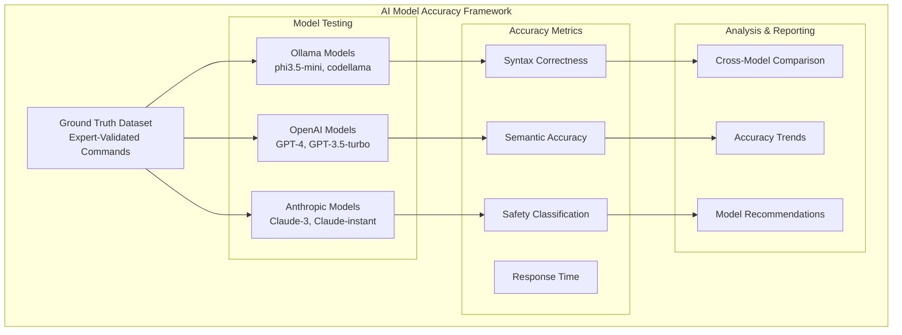

# AI Model Accuracy Benchmarking Framework

## Overview

This document defines comprehensive accuracy benchmarking for KubeChat's AI models, ensuring consistent kubectl command generation quality across Ollama local models and cloud AI providers. Accuracy is **CRITICAL** for user trust and operational safety in production Kubernetes environments.

**Performance Targets:**  
- Common Operations: >95% accuracy  
- Complex Operations: >85% accuracy  
- Command Syntax Correctness: >99%  
- Cross-Model Consistency: <10% variance

**Risk Level:** HIGH - Poor accuracy undermines user confidence and operational effectiveness

---

## Benchmarking Architecture

### Multi-Model Testing Framework



---

## Ground Truth Dataset

### Expert-Validated Command Dataset

```yaml
# test/ai-accuracy/datasets/ground-truth-commands.yaml

ground_truth_dataset:
  metadata:
    version: "1.0"
    total_queries: 2000
    expert_validators: 5
    validation_rounds: 3
    last_updated: "2025-01-10"
    
  categories:
    basic_operations:
      count: 500
      examples:
        - query: "show all pods"
          expected_command: "kubectl get pods --all-namespaces"
          difficulty: "easy"
          safety_level: "safe"
          
        - query: "list services in default namespace"
          expected_command: "kubectl get services -n default"
          difficulty: "easy"
          safety_level: "safe"
          
        - query: "describe deployment nginx"
          expected_command: "kubectl describe deployment nginx"
          difficulty: "easy"
          safety_level: "safe"
          
    resource_management:
      count: 400
      examples:
        - query: "scale deployment frontend to 3 replicas"
          expected_command: "kubectl scale deployment frontend --replicas=3"
          difficulty: "medium"
          safety_level: "warning"
          
        - query: "create a configmap from file config.yaml"
          expected_command: "kubectl create configmap myconfig --from-file=config.yaml"
          difficulty: "medium"
          safety_level: "warning"
          
    monitoring_debugging:
      count: 300
      examples:
        - query: "show logs for pod nginx-12345 from last 10 minutes"
          expected_command: "kubectl logs nginx-12345 --since=10m"
          difficulty: "medium"
          safety_level: "safe"
          
        - query: "get events sorted by timestamp"
          expected_command: "kubectl get events --sort-by='.metadata.creationTimestamp'"
          difficulty: "hard"
          safety_level: "safe"
          
    complex_operations:
      count: 300
      examples:
        - query: "find pods using more than 500Mi memory"
          expected_command: "kubectl top pods --all-namespaces | awk '$3 > 500'"
          difficulty: "hard"
          safety_level: "safe"
          alternatives:
            - "kubectl get pods --all-namespaces -o custom-columns='NAME:.metadata.name,NAMESPACE:.metadata.namespace,MEMORY:.status.containerStatuses[*].resources.requests.memory'"
          
        - query: "show deployments without resource limits"
          expected_command: "kubectl get deployments -o json | jq '.items[] | select(.spec.template.spec.containers[].resources.limits == null) | .metadata.name'"
          difficulty: "hard"
          safety_level: "safe"
          
    security_operations:
      count: 200
      examples:
        - query: "list all service accounts with cluster-admin role"
          expected_command: "kubectl get clusterrolebindings -o json | jq '.items[] | select(.roleRef.name==\"cluster-admin\") | .subjects[]'"
          difficulty: "hard"
          safety_level: "warning"
          
    dangerous_operations:
      count: 300
      examples:
        - query: "delete pod nginx-failed"
          expected_command: "kubectl delete pod nginx-failed"
          difficulty: "easy"
          safety_level: "dangerous"
          
        - query: "force delete stuck pod"
          expected_command: "kubectl delete pod <pod-name> --grace-period=0 --force"
          difficulty: "medium"
          safety_level: "dangerous"
```

---

## Model Accuracy Testing Framework

### Syntax Correctness Tests

```go
// test/ai-accuracy/syntax_correctness_test.go

package aiaccuracy

import (
    "testing"
    "github.com/pramodksahoo/kubechat/internal/ai/providers"
    "github.com/pramodksahoo/kubechat/internal/kubectl/validator"
)

func TestCommandSyntaxCorrectness(t *testing.T) {
    groundTruthDataset := loadGroundTruthDataset()
    models := []providers.AIModel{
        providers.NewOllamaModel("phi3.5-mini"),
        providers.NewOllamaModel("codellama:34b"),
        providers.NewOpenAIModel("gpt-4"),
        providers.NewOpenAIModel("gpt-3.5-turbo"),
        providers.NewAnthropicModel("claude-3-sonnet"),
    }

    syntaxValidator := validator.NewKubectlSyntaxValidator()
    
    for _, model := range models {
        t.Run(fmt.Sprintf("Model_%s", model.Name()), func(t *testing.T) {
            var (
                totalQueries      int
                syntaxCorrect     int
                syntaxIncorrect   int
                processingErrors  int
            )
            
            for _, testCase := range groundTruthDataset.TestCases {
                totalQueries++
                
                // Generate command using AI model
                result, err := model.GenerateCommand(testCase.Query)
                if err != nil {
                    processingErrors++
                    t.Logf("Processing error for query '%s': %v", testCase.Query, err)
                    continue
                }
                
                // Validate kubectl syntax
                syntaxResult := syntaxValidator.ValidateCommand(result.Command)
                if syntaxResult.IsValid {
                    syntaxCorrect++
                } else {
                    syntaxIncorrect++
                    t.Logf("Syntax error in command '%s': %v", result.Command, syntaxResult.Errors)
                }
            }
            
            // Calculate accuracy metrics
            syntaxAccuracy := float64(syntaxCorrect) / float64(totalQueries) * 100
            errorRate := float64(processingErrors) / float64(totalQueries) * 100
            
            // Assert minimum accuracy requirements
            if syntaxAccuracy < 99.0 {
                t.Errorf("Syntax accuracy below requirement for %s: %.2f%% (required: 99%%)",
                    model.Name(), syntaxAccuracy)
            }
            
            if errorRate > 1.0 {
                t.Errorf("Error rate too high for %s: %.2f%% (max: 1%%)",
                    model.Name(), errorRate)
            }
            
            t.Logf("Model %s - Syntax Accuracy: %.2f%%, Error Rate: %.2f%%",
                model.Name(), syntaxAccuracy, errorRate)
        })
    }
}
```

### Semantic Accuracy Tests

```go
// test/ai-accuracy/semantic_accuracy_test.go

func TestSemanticAccuracy(t *testing.T) {
    groundTruthDataset := loadGroundTruthDataset()
    semanticValidator := validator.NewSemanticValidator()
    
    models := getTestModels()
    
    for _, model := range models {
        t.Run(fmt.Sprintf("Semantic_%s", model.Name()), func(t *testing.T) {
            categoryResults := make(map[string]*AccuracyResult)
            
            for category, testCases := range groundTruthDataset.Categories {
                result := &AccuracyResult{
                    Category: category,
                    Model:    model.Name(),
                }
                
                for _, testCase := range testCases {
                    // Generate command
                    generated, err := model.GenerateCommand(testCase.Query)
                    if err != nil {
                        result.Errors++
                        continue
                    }
                    
                    // Evaluate semantic correctness
                    semanticScore := semanticValidator.EvaluateSemanticMatch(
                        generated.Command,
                        testCase.ExpectedCommand,
                        testCase.Alternatives,
                    )
                    
                    result.TotalTests++
                    result.SemanticScores = append(result.SemanticScores, semanticScore)
                    
                    // Categorize accuracy levels
                    switch {
                    case semanticScore >= 0.95:
                        result.HighAccuracy++
                    case semanticScore >= 0.85:
                        result.MediumAccuracy++
                    case semanticScore >= 0.70:
                        result.LowAccuracy++
                    default:
                        result.Failed++
                    }
                }
                
                // Calculate category metrics
                result.CalculateMetrics()
                categoryResults[category] = result
                
                // Validate category-specific requirements
                switch category {
                case "basic_operations":
                    if result.AverageAccuracy < 95.0 {
                        t.Errorf("Basic operations accuracy too low for %s: %.2f%% (required: 95%%)",
                            model.Name(), result.AverageAccuracy)
                    }
                case "complex_operations":
                    if result.AverageAccuracy < 85.0 {
                        t.Errorf("Complex operations accuracy too low for %s: %.2f%% (required: 85%%)",
                            model.Name(), result.AverageAccuracy)
                    }
                }
            }
            
            // Generate comprehensive report
            generateAccuracyReport(model.Name(), categoryResults)
        })
    }
}

type AccuracyResult struct {
    Category        string
    Model          string
    TotalTests     int
    HighAccuracy   int    // >= 95%
    MediumAccuracy int    // 85-94%
    LowAccuracy    int    // 70-84%
    Failed         int    // < 70%
    Errors         int
    SemanticScores []float64
    AverageAccuracy float64
    StandardDeviation float64
}

func (r *AccuracyResult) CalculateMetrics() {
    if len(r.SemanticScores) == 0 {
        return
    }
    
    // Calculate average
    sum := 0.0
    for _, score := range r.SemanticScores {
        sum += score
    }
    r.AverageAccuracy = (sum / float64(len(r.SemanticScores))) * 100
    
    // Calculate standard deviation
    variance := 0.0
    for _, score := range r.SemanticScores {
        variance += math.Pow(score*100-r.AverageAccuracy, 2)
    }
    r.StandardDeviation = math.Sqrt(variance / float64(len(r.SemanticScores)))
}
```

### Cross-Model Consistency Tests

```go
// test/ai-accuracy/cross_model_consistency_test.go

func TestCrossModelConsistency(t *testing.T) {
    models := getTestModels()
    testQueries := loadConsistencyTestQueries() // Subset focused on consistency
    
    consistencyThreshold := 0.9 // 90% similarity expected between models
    maxVariance := 10.0 // Maximum 10% variance in accuracy
    
    for _, query := range testQueries {
        t.Run(fmt.Sprintf("Consistency_Query_%d", query.ID), func(t *testing.T) {
            modelResults := make(map[string]*ModelResult)
            
            // Get results from all models
            for _, model := range models {
                result, err := model.GenerateCommand(query.Text)
                if err != nil {
                    t.Logf("Model %s failed for query '%s': %v", model.Name(), query.Text, err)
                    continue
                }
                
                modelResults[model.Name()] = &ModelResult{
                    Command:     result.Command,
                    Confidence:  result.Confidence,
                    SafetyLevel: result.SafetyLevel,
                    Reasoning:   result.Reasoning,
                }
            }
            
            // Compare results between models
            consistencyScores := calculateConsistencyScores(modelResults)
            
            for modelPair, score := range consistencyScores {
                if score < consistencyThreshold {
                    t.Errorf("Low consistency between %s: %.2f (required: %.2f)",
                        modelPair, score, consistencyThreshold)
                }
            }
            
            // Check command semantic similarity
            commands := extractCommands(modelResults)
            semanticSimilarity := calculateSemanticSimilarity(commands)
            
            if semanticSimilarity < consistencyThreshold {
                t.Errorf("Low semantic similarity across models: %.2f (required: %.2f)",
                    semanticSimilarity, consistencyThreshold)
            }
        })
    }
}

func calculateConsistencyScores(results map[string]*ModelResult) map[string]float64 {
    scores := make(map[string]float64)
    models := make([]string, 0, len(results))
    
    for model := range results {
        models = append(models, model)
    }
    
    // Compare each pair of models
    for i := 0; i < len(models); i++ {
        for j := i + 1; j < len(models); j++ {
            model1, model2 := models[i], models[j]
            pairKey := fmt.Sprintf("%s_vs_%s", model1, model2)
            
            result1 := results[model1]
            result2 := results[model2]
            
            // Calculate similarity score
            score := calculateResultSimilarity(result1, result2)
            scores[pairKey] = score
        }
    }
    
    return scores
}
```

---

## Performance Benchmarking

### Response Time Testing

```go
// test/ai-accuracy/performance_benchmarks_test.go

func TestModelResponseTimes(t *testing.T) {
    models := getTestModels()
    testQueries := loadPerformanceTestQueries()
    
    performanceTargets := map[string]time.Duration{
        "ollama":    3000 * time.Millisecond, // Local processing
        "openai":    2000 * time.Millisecond, // Cloud API
        "anthropic": 2500 * time.Millisecond, // Cloud API
    }
    
    for _, model := range models {
        t.Run(fmt.Sprintf("Performance_%s", model.Name()), func(t *testing.T) {
            var responseTimes []time.Duration
            var errors int
            
            for _, query := range testQueries {
                start := time.Now()
                _, err := model.GenerateCommand(query.Text)
                duration := time.Since(start)
                
                if err != nil {
                    errors++
                    continue
                }
                
                responseTimes = append(responseTimes, duration)
            }
            
            // Calculate performance metrics
            avgTime := calculateAverage(responseTimes)
            p95Time := calculatePercentile(responseTimes, 95)
            p99Time := calculatePercentile(responseTimes, 99)
            
            // Get target based on model type
            target := getPerformanceTarget(model.Name(), performanceTargets)
            
            // Validate performance requirements
            if avgTime > target {
                t.Errorf("Average response time too high for %s: %v (target: %v)",
                    model.Name(), avgTime, target)
            }
            
            if p95Time > target*2 { // P95 can be 2x average
                t.Errorf("P95 response time too high for %s: %v (max: %v)",
                    model.Name(), p95Time, target*2)
            }
            
            errorRate := float64(errors) / float64(len(testQueries)) * 100
            if errorRate > 1.0 {
                t.Errorf("Error rate too high for %s: %.2f%% (max: 1%%)",
                    model.Name(), errorRate)
            }
            
            t.Logf("Model %s Performance - Avg: %v, P95: %v, P99: %v, Errors: %.2f%%",
                model.Name(), avgTime, p95Time, p99Time, errorRate)
        })
    }
}
```

### Concurrent Processing Tests

```go
func TestConcurrentProcessing(t *testing.T) {
    models := getTestModels()
    concurrencyLevels := []int{1, 5, 10, 25, 50}
    testQuery := "show all pods in production namespace"
    
    for _, model := range models {
        t.Run(fmt.Sprintf("Concurrent_%s", model.Name()), func(t *testing.T) {
            
            for _, concurrency := range concurrencyLevels {
                t.Run(fmt.Sprintf("Level_%d", concurrency), func(t *testing.T) {
                    
                    start := time.Now()
                    
                    // Create concurrent requests
                    var wg sync.WaitGroup
                    results := make(chan *ProcessingResult, concurrency)
                    
                    for i := 0; i < concurrency; i++ {
                        wg.Add(1)
                        go func() {
                            defer wg.Done()
                            
                            requestStart := time.Now()
                            result, err := model.GenerateCommand(testQuery)
                            requestTime := time.Since(requestStart)
                            
                            results <- &ProcessingResult{
                                Success:      err == nil,
                                ResponseTime: requestTime,
                                Result:       result,
                            }
                        }()
                    }
                    
                    wg.Wait()
                    close(results)
                    totalTime := time.Since(start)
                    
                    // Analyze results
                    var (
                        successful   int
                        failed       int
                        responseTimes []time.Duration
                    )
                    
                    for result := range results {
                        if result.Success {
                            successful++
                            responseTimes = append(responseTimes, result.ResponseTime)
                        } else {
                            failed++
                        }
                    }
                    
                    // Validate concurrent performance
                    successRate := float64(successful) / float64(concurrency) * 100
                    if successRate < 99.0 {
                        t.Errorf("Success rate too low at concurrency %d: %.2f%% (required: 99%%)",
                            concurrency, successRate)
                    }
                    
                    if len(responseTimes) > 0 {
                        avgResponseTime := calculateAverage(responseTimes)
                        // Allow 50% degradation at high concurrency
                        maxAllowedTime := getBaselineTime(model.Name()) * time.Duration(1+concurrency/100)
                        
                        if avgResponseTime > maxAllowedTime {
                            t.Errorf("Average response time degraded too much at concurrency %d: %v (max: %v)",
                                concurrency, avgResponseTime, maxAllowedTime)
                        }
                    }
                    
                    t.Logf("Concurrency %d - Success: %.2f%%, Avg Response: %v, Total Time: %v",
                        concurrency, successRate, calculateAverage(responseTimes), totalTime)
                })
            }
        })
    }
}
```

---

## Model Comparison & Recommendation Engine

### Comparative Analysis Framework

```go
// test/ai-accuracy/model_comparison_test.go

func TestModelComparisonAnalysis(t *testing.T) {
    models := getTestModels()
    comparisonCriteria := []ComparisonCriterion{
        {Name: "accuracy", Weight: 0.4},
        {Name: "speed", Weight: 0.2},
        {Name: "consistency", Weight: 0.2},
        {Name: "safety", Weight: 0.2},
    }
    
    modelScores := make(map[string]*ModelScore)
    
    for _, model := range models {
        score := &ModelScore{
            ModelName: model.Name(),
            Criteria:  make(map[string]float64),
        }
        
        // Run comprehensive evaluation
        accuracyScore := evaluateModelAccuracy(model)
        speedScore := evaluateModelSpeed(model)
        consistencyScore := evaluateModelConsistency(model)
        safetyScore := evaluateModelSafety(model)
        
        score.Criteria["accuracy"] = accuracyScore
        score.Criteria["speed"] = speedScore
        score.Criteria["consistency"] = consistencyScore
        score.Criteria["safety"] = safetyScore
        
        // Calculate weighted overall score
        score.OverallScore = calculateWeightedScore(score.Criteria, comparisonCriteria)
        modelScores[model.Name()] = score
    }
    
    // Generate recommendations
    recommendations := generateModelRecommendations(modelScores)
    
    // Validate recommendations make sense
    validateRecommendations(t, recommendations, modelScores)
    
    // Generate comparison report
    generateComparisonReport(modelScores, recommendations)
}

type ModelScore struct {
    ModelName    string
    Criteria     map[string]float64
    OverallScore float64
    Strengths    []string
    Weaknesses   []string
}

type ComparisonCriterion struct {
    Name   string
    Weight float64
}

type ModelRecommendation struct {
    UseCase     string
    RecommendedModel string
    Rationale   string
    Alternatives []string
}

func generateModelRecommendations(scores map[string]*ModelScore) []ModelRecommendation {
    recommendations := []ModelRecommendation{
        {
            UseCase: "air_gapped_deployment",
            RecommendedModel: findBestOllamaModel(scores),
            Rationale: "Best local model for offline environments",
            Alternatives: getAllOllamaModels(scores),
        },
        {
            UseCase: "high_accuracy_queries",
            RecommendedModel: findHighestAccuracyModel(scores),
            Rationale: "Highest accuracy for complex operations",
            Alternatives: getTopAccuracyModels(scores, 3),
        },
        {
            UseCase: "low_latency_operations",
            RecommendedModel: findFastestModel(scores),
            Rationale: "Fastest response times for interactive use",
            Alternatives: getTopSpeedModels(scores, 3),
        },
        {
            UseCase: "enterprise_production",
            RecommendedModel: findBestOverallModel(scores),
            Rationale: "Best balance of accuracy, speed, and safety",
            Alternatives: getTopOverallModels(scores, 3),
        },
    }
    
    return recommendations
}
```

### Accuracy Degradation Monitoring

```go
// test/ai-accuracy/degradation_monitoring_test.go

func TestAccuracyDegradationDetection(t *testing.T) {
    models := getTestModels()
    baselineMetrics := loadBaselineMetrics() // Historical performance data
    
    for _, model := range models {
        t.Run(fmt.Sprintf("Degradation_%s", model.Name()), func(t *testing.T) {
            // Get current performance
            currentMetrics := measureCurrentPerformance(model)
            baseline := baselineMetrics[model.Name()]
            
            if baseline == nil {
                t.Logf("No baseline data for %s, establishing new baseline", model.Name())
                saveBaseline(model.Name(), currentMetrics)
                return
            }
            
            // Check for significant degradation
            accuracyDrop := baseline.Accuracy - currentMetrics.Accuracy
            speedIncrease := currentMetrics.AverageResponseTime - baseline.AverageResponseTime
            
            // Alert on accuracy degradation
            if accuracyDrop > 5.0 { // 5% accuracy drop threshold
                t.Errorf("Significant accuracy degradation detected for %s: %.2f%% drop",
                    model.Name(), accuracyDrop)
            }
            
            // Alert on speed degradation  
            if speedIncrease > baseline.AverageResponseTime*0.5 { // 50% speed increase
                t.Errorf("Significant speed degradation detected for %s: %v increase",
                    model.Name(), speedIncrease)
            }
            
            // Check for improvement opportunities
            if currentMetrics.Accuracy > baseline.Accuracy+2.0 {
                t.Logf("Performance improvement detected for %s: %.2f%% accuracy gain",
                    model.Name(), currentMetrics.Accuracy-baseline.Accuracy)
                updateBaseline(model.Name(), currentMetrics)
            }
        })
    }
}
```

---

## Automated Reporting & Dashboards

### Accuracy Dashboard Generation

```yaml
# Automated reporting configuration
accuracy_reporting:
  dashboard_generation:
    frequency: "daily"
    metrics_included:
      - Overall accuracy by model
      - Category-specific performance
      - Response time trends
      - Error rates and patterns
      - Cross-model consistency
      
  alerting_thresholds:
    accuracy_drop: "> 5%"
    response_time_increase: "> 50%"
    error_rate: "> 2%"
    consistency_variance: "> 15%"
    
  report_distribution:
    - Development team (daily)
    - Product management (weekly)
    - Executive summary (monthly)
    - Customer-facing metrics (quarterly)
```

### Continuous Benchmarking Pipeline

```yaml
# CI/CD integration for accuracy testing
accuracy_pipeline:
  triggers:
    - AI model updates
    - Prompt template changes
    - Dataset modifications
    - Weekly scheduled runs
    
  test_execution:
    - Syntax correctness validation
    - Semantic accuracy measurement
    - Performance benchmarking
    - Cross-model consistency checks
    - Safety classification accuracy
    
  quality_gates:
    - Minimum accuracy thresholds
    - Maximum response time limits
    - Error rate constraints
    - Consistency requirements
    
  automated_actions:
    - Model deployment decisions
    - Performance alert generation
    - Baseline metric updates
    - Trend analysis reports
```

This comprehensive AI Model Accuracy Benchmarking Framework ensures KubeChat maintains consistent, high-quality kubectl command generation across all supported AI models while providing actionable insights for model selection and optimization.

---

*🧪 Generated by Test Architect Quinn*  
*Focus: Maintaining >95% accuracy across all AI models*